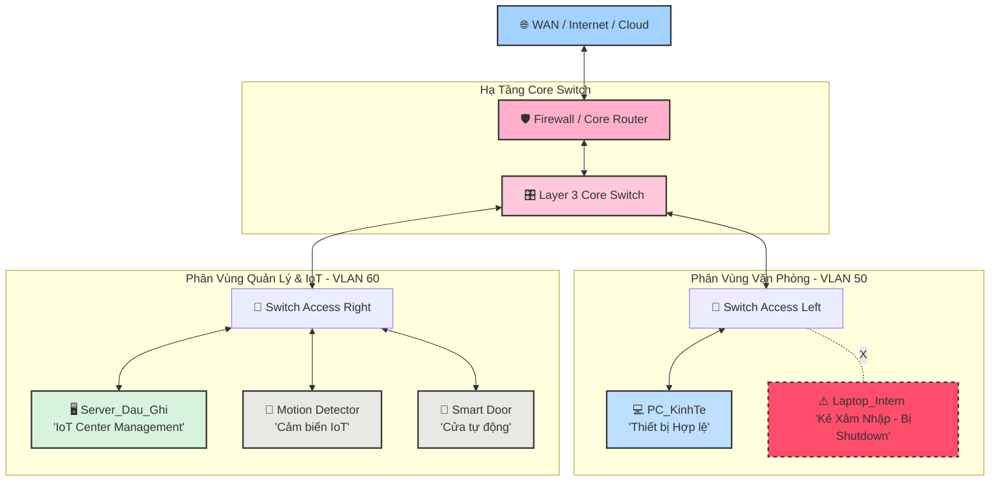

# 🏢 Smart Enterprise Network with Port Security

Hạ tầng mạng doanh nghiệp thông minh mô phỏng trên nền tảng **Cisco Packet Tracer**. Dự án triển khai giải pháp tự động hóa tòa nhà bằng công nghệ IoT quản lý tập trung, kết hợp chính sách bảo mật lớp Access kiểm soát toàn diện thiết bị ngoại vi đầu cuối.

---

## 🗺️ Sơ Đồ Kiến Trúc Hệ Thống (System Architecture)

---

## 🛠️ Công Nghệ & Giải Pháp Triển Khai

| Phân Vùng | Thiết Bị & Công Nghệ | Giải Pháp Bảo Mật / Tự Động Hóa | Trạng Thái Demo |
| :--- | :--- | :--- | :--- |
| **Hạ tầng Mạng** | `Cisco Core Switch` `VLAN 50/60` | Định tuyến và chia vùng độc lập bảo mật |  |
| **Phòng IoT** | `Smart Door` `Motion Sensor` `Server` | Tự động hóa qua cơ chế **IoT Conditions** trên Web Browser |  |
| **Văn Phòng** | `Switch Access` `Sticky MAC` | Ngăn chặn truy cập Internet trái phép bằng **Port Security Violation Shutdown** |  |

---

## 🧪 Cơ Chế Hoạt Động (Demo Logic)

*   **Cơ chế tự động hóa IoT**: Khi thiết bị `Motion Detector` phát hiện có người di chuyển tới gần $\rightarrow$ `Server_Dau_Ghi` nhận tín hiệu $\rightarrow$ Gửi lệnh `Unlock` kích hoạt mở **Smart Door**. Sau khi nhân sự đi qua, cửa tự động phản hồi đóng và khóa lại.
*   **Cơ chế an ninh Port Security**: Khi `Laptop_Intern` (máy lạ) cố tình đấu nối trực tiếp vào cổng mạng của `PC_KinhTe` $\rightarrow$ `Switch Access` nhận diện sai địa chỉ MAC Sticky $\rightarrow$ Kích hoạt trạng thái **Violation Shutdown** ngay lập tức. Cổng mạng chuyển sang màu đỏ (Err-Disabled), chặn đứng toàn bộ lưu lượng Internet và cô lập hoàn toàn thiết bị lạ khỏi hệ thống.
