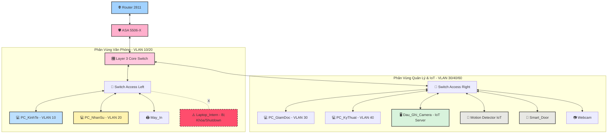

# 🏢 Smart Enterprise Network with Port Security

Hạ tầng mạng doanh nghiệp thông minh đa phân vùng được mô phỏng trên nền tảng **Cisco Packet Tracer**. Dự án triển khai giải pháp tự động hóa tòa nhà bằng công nghệ IoT quản lý tập trung, kết hợp chính sách bảo mật lớp Access kiểm soát toàn diện thiết bị ngoại vi đầu cuối tại phân vùng văn phòng.

---

## 🗺️ Sơ Đồ Kiến Trúc Hệ Thống (System Architecture)

---

## 🛠️ Công Nghệ & Giải Pháp Triển Khai

| Phân Vùng | Thiết Bị Đầu Cuối | Công Nghệ & Giải Pháp | Trạng Thái Demo |
| :--- | :--- | :--- | :--- |
| **Hạ tầng Mạng** | `Core Switch` `Router 2811` `ASA 5506-X` | Chia VLAN phòng ban (VLAN 10/20/30/40), định tuyến Inter-VLAN |  |
| **Hệ Thống IoT** | `Smart_Door` `Motion Detector` `Dau_Ghi_Camera` | Tự động hóa qua cơ chế **IoT Conditions** trên nền tảng Web quản lý |  |
| **Bảo Mật Cổng** | `Switch Access Left` | Ngăn chặn thiết bị lạ truy cập Internet bằng **Port Security Violation Shutdown** |  |

---

## 🧪 Cơ Chế Hoạt Động (Demo Logic)

### 1. Cơ chế kiểm soát an ninh tại cửa ngõ doanh nghiệp (Firewall ASA 5506-X)
* **Kịch bản**: Các kết nối từ mạng Internet bên ngoài cố gắng truy cập vào tài nguyên nội bộ và ngược lại.
* **Logic hoạt động**: 
  * Tường lửa ASA 5506-X đóng vai trò là chốt chặn an ninh tối cao giữa vùng **Inside** (Mạng doanh nghiệp) và vùng **Outside** (Mạng Internet công cộng).
  * **Kiểm soát truy cập (Access Control List - ACL)**: Firewall được cấu hình chính sách nghiêm ngặt, chỉ cho phép các luồng dữ liệu hợp lệ (như Mail, Web, DNS) đi từ ngoài vào các Server được chỉ định, đồng thời chặn đứng các cuộc tấn công quét cổng (Port Scanning) hoặc xâm nhập trái phép từ Internet.
  * **Giám sát trạng thái gói tin (Stateful Inspection)**: Khi nhân viên bên trong mạng (vùng Inside) truy cập Internet, Firewall sẽ tự động ghi nhớ trạng thái kết nối để cho phép dữ liệu phản hồi quay trở lại, nhưng sẽ chặn tất cả các gói tin lạ tự khởi tạo từ bên ngoài hướng vào bên trong.

### 2. Cơ chế cấp phát và kết nối không dây bảo mật (Wireless Router)
* **Kịch bản**: Khách hàng, đối tác hoặc nhân viên sử dụng thiết bị cá nhân di động (`Laptop_Personal`, `Smartphone2`, `Tablet PC0`) kết nối vào mạng không dây nội bộ.
* **Logic hoạt động**:
  * **Xác thực bảo mật**: Các thiết bị di động gửi yêu cầu kết nối không dây qua sóng Wi-Fi của `Wireless Router1`. Thiết bị phải vượt qua cơ chế xác thực mã hóa bảo mật (Ví dụ: WPA2-PSK) để tránh các nguy cơ nghe lén dữ liệu trên không gian mạng.
  * **Cấp phát IP động (DHCP)**: Sau khi kết nối Wi-Fi thành công, `Wireless Router1` (hoặc Core Switch đóng vai trò DHCP Server) tự động cấp phát địa chỉ IP động, Subnet Mask và Default Gateway cho thiết bị.
  * **Định tuyến không dây**: Thiết bị di động không dây có thể giao tiếp mượt mà với các phân vùng mạng dây khác (VLAN văn phòng, vùng Server) và đi ra Internet dưới sự kiểm soát định tuyến của Core Switch và Firewall.

### 3. Cơ chế tự động hóa IoT & Giám sát an ninh (Khu vực bên phải)
* **Kịch bản**: Nhân viên di chuyển qua lại tại khu vực cửa ra vào văn phòng.
* **Logic hoạt động**: 
  * `Motion Detector` phát hiện có chuyển động $\rightarrow$ truyền tín hiệu số về Server quản lý `Dau_Ghi_Camera` ($192.168.60.3$).
  * Hệ thống tự động kích hoạt luật mở khóa `Unlock` cho thiết bị `Smart_Door` để nhân viên ra vào. Khi không còn người, cửa tự động phản hồi đóng và chốt khóa lại nhằm bảo mật an ninh tòa nhà.
  * **Tích hợp Camera giám sát**: Song song với quá trình mở cửa, thiết bị `Webcam` cảm biến liên kết trực tiếp với server `Dau_Ghi_Camera` sẽ tự động kích hoạt chế độ ghi hình (On), truyền luồng dữ liệu video thời gian thực về lưu trữ tại bộ nhớ của hệ thống Đầu ghi nhằm phục vụ công tác hậu kiểm và giám sát an ninh doanh nghiệp.

### 4. Cơ chế vận hành dịch vụ mạng cốt lõi (Web, DNS, Email)
* **Kịch bản**: Nhân sự thuộc các phòng ban thực hiện truy cập website nội bộ và gửi nhận email công việc.
* **Logic hoạt động**:
  * **Phân giải tên miền (DNS)**: Khi một máy trạm (Ví dụ: `PC_GiamDoc`) nhập địa chỉ tên miền của công ty trên trình duyệt web, gói tin yêu cầu giải mã sẽ được gửi tới DNS Server. DNS Server thực hiện tra cứu bảng ghi và trả về địa chỉ IP chính xác của máy chủ Web.
  * **Dịch vụ Web (HTTP/HTTPS)**: Máy trạm sử dụng IP vừa phân giải để kết nối trực tiếp đến `Web Server`, tải về giao diện trang chủ của doanh nghiệp một cách mượt mà thông qua hạ tầng định tuyến Inter-VLAN của Core Switch.
  * **Hệ thống Email (SMTP/POP3)**: Khi nhân viên gửi email, giao thức `SMTP` trên Mail Server sẽ tiếp nhận, kiểm tra tính hợp lệ và định tuyến thư điện tử đến đúng hộp thư của người nhận, đảm bảo luồng thông tin liên lạc nội bộ luôn thông suốt.

### 5. Cơ chế an ninh Port Security (Khu vực bên trái)
* **Kịch bản**: Kẻ gian hoặc nhân sự không phận sự cố tình rút dây mạng từ máy `PC_KinhTe` (Cổng `Fa0/2`) ra để kết nối thiết bị lạ `Laptop_Intern` vào hệ thống mạng nội bộ công ty.
* **Logic hoạt động**: 
  * `Switch Access Left` phát hiện địa chỉ MAC vật lý của `Laptop_Intern` không khớp với địa chỉ **MAC Sticky** hợp lệ duy nhất của máy tính công ty đã được lưu cấu hình trước đó. 
  * Cơ chế an ninh lập tức được kích hoạt, đưa cổng `Fa0/2` vào trạng thái lỗi độc quyền **Err-Disabled (Shutdown)**. Cổng kết nối trên sơ đồ lập tức chuyển sang màu đỏ rực, chặn đứng toàn bộ lưu lượng Internet/Intranet, cô lập hoàn toàn thiết bị tấn công và bảo vệ an toàn tuyệt đối cho các tài nguyên dữ liệu phía sau (Web, DNS, IoT Server) không bị rò rỉ ra ngoài.

